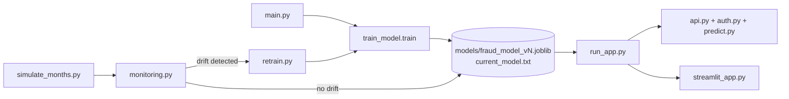

# Fraud Detection MLOps Project

An end-to-end MLOps pipeline for credit card fraud detection: train candidate
models, serve the best one behind an authenticated API, monitor incoming data
for drift, and automatically retrain when drift is detected — closing the
CI/CD loop.

## Project flow



1. **Train** (`main.py` → `src/train_model.py`): loads raw data, cleans and
   engineers features, cross-validates several candidate models (logistic
   regression, random forest, SVC), picks the best by PR-AUC, retrains it on
   the full dataset, and saves a new versioned model
   (`models/fraud_model_vN.joblib` + `models/current_model.txt`).
2. **Serve** (`run_app.py`): starts the Flask API (`src/api.py`, protected by
   `src/auth.py`) and the Streamlit UI (`src/streamlit_app.py`), which calls
   the API to score transactions.
3. **Simulate & monitor** (`src/simulate_months.py`, `src/monitoring.py`):
   generates 12 months of synthetic data with injected drift, then runs
   statistical drift tests (Kolmogorov-Smirnov for numeric features,
   chi-square for categorical features) against the reference training data.
4. **Retrain** (`src/retrain.py`): triggered when drift is detected, re-runs
   the training pipeline (`python -m src.retrain`) to produce a new
   model version, restarting the cycle.

This cycle is automated in [`.github/workflows/mlops.yml`](.github/workflows/mlops.yml),
which runs monthly and on every push to `main`: it simulates all 12 months,
monitors each one, retrains automatically whenever drift is found, and then
verifies the retrained model is actually reachable over the API.
[`.github/workflows/ci.yml`](.github/workflows/ci.yml) runs `just check`
(formatting, linting, type checking, tests) on every push and pull request.

## Setup

All tasks run through [`just`](https://github.com/casey/just), a task runner —
one short command per job instead of remembering long ones. Install it once:

```powershell
winget install --id Casey.Just
```

Then install [`uv`](https://docs.astral.sh/uv/) (manages the Python version,
virtual environment, and dependencies):

```powershell
powershell -ExecutionPolicy ByPass -c "irm https://astral.sh/uv/install.ps1 | iex"
```

Set up the project:

```powershell
just setup
```

Copy `.env.example` to `.env` and set your API key:

```
API_KEY=your-api-key-here
```

Run `just` with no arguments to see every available command.

## Usage

### 1. Train a model

```powershell
just train
```

Saves a new versioned model to `models/` and updates `current_model.txt`.

### 2. Serve the app (API + UI)

```powershell
just serve
```

Starts the Flask API on `http://127.0.0.1:5000` and the Streamlit UI on
`http://127.0.0.1:8501`, opening the UI in your browser automatically.

Score a transaction directly against the API:

```powershell
curl -X POST http://127.0.0.1:5000/predict `
  -H "Authorization: Bearer your-api-key-here" `
  -H "Content-Type: application/json" `
  -d '{"trans_date_trans_time": "01-01-2024 12:00", ...}'
```

### 3. Simulate data and check for drift

```powershell
just simulate
just monitor
```

`just monitor` checks all 12 simulated months at once. To check a single
month (used by the CI/CD workflow), run `just monitor-month 4`.
Drift is injected into months 4, 6, 8, 10 and 12 to demonstrate detection.

### 4. Retrain on drift

```powershell
just retrain
```

Re-runs the training pipeline and produces the next model version
(e.g. `fraud_model_v6.joblib`).

### 5. Check everything (format, lint, type-check, test)

```powershell
just check
```

This is the exact command CI runs — a green `just check` locally means a
green pipeline. Individual pieces (`just fmt`, `just lint`, `just typecheck`,
`just test`) are also available for faster iteration.

## CI/CD

- **`ci.yml`** — installs dependencies with `uv` and runs `just check` on
  every push and pull request.
- **`mlops.yml`** — runs monthly (scheduled) and on every push to `main`:
  simulates 12 months of data, runs drift monitoring for each month,
  automatically retrains the model whenever drift is detected, and verifies
  the retrained model is reachable over the live API.

CI runs on Linux; local development happens on Windows. `just check` passing
locally is what guarantees CI will also pass — see `ACTION_PLAN.md` if
something diverges between the two.
