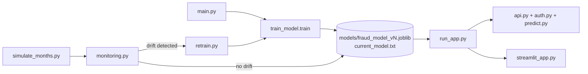

# Fraud Detection MLOps Project

An end-to-end MLOps pipeline for credit card fraud detection: train candidate
models, serve the best one behind an authenticated API, monitor incoming data
for drift, and automatically retrain when drift is detected — closing the
CI/CD loop.

## Project flow



1. **Train** (`main.py` → `src/train_model.py`): loads raw data, cleans and
   engineers features, cross-validates several candidate models (logistic
   regression, random forest, SVC), picks the best by PR-AUC, retrains it on
   the full dataset, and saves a new versioned model
   (`models/fraud_model_vN.joblib` + `models/current_model.txt`).
2. **Serve** (`run_app.py`): starts the Flask API (`src/api.py`, protected by
   `src/auth.py`) and the Streamlit UI (`src/streamlit_app.py`), which calls
   the API to score transactions.
3. **Simulate & monitor** (`src/simulate_months.py`, `src/monitoring.py`):
   generates 12 months of synthetic data with injected drift, then runs
   statistical drift tests (Kolmogorov-Smirnov for numeric features,
   chi-square for categorical features) against the reference training data.
4. **Retrain** (`src/retrain.py`): triggered when drift is detected, re-runs
   the training pipeline (`python -m src.train_model`) to produce a new
   model version, restarting the cycle.

This cycle is automated in [`.github/workflows/mlops.yml`](.github/workflows/mlops.yml),
which simulates all 12 months, monitors each one, and retrains automatically
whenever drift is found. [`.github/workflows/ci.yml`](.github/workflows/ci.yml)
runs the test suite on every push.

## Project structure

```
main.py                 # Entry point for the training pipeline
run_app.py               # Entry point for serving (API + Streamlit UI)
requirements.txt

data/
  raw/                    # Original raw dataset (fraud_data.csv)
  processed/              # Cleaned dataset used as drift reference
  monthly/                # Simulated monthly data (with injected drift)
  example/                # Sample input for manual predictions

models/
  fraud_model_v*.joblib   # Versioned trained models
  current_model.txt       # Name of the model currently in production

notebooks/
  eda.py                  # Exploratory data analysis (manual, not in pipeline)

src/
  data_loader.py          # load_raw_data()
  preprocess.py            # Feature engineering + cleaning (used by train_model)
  train_model.py           # train() — full training/selection/versioning pipeline
  predict.py               # CLI scoring of transactions with the saved model
  api.py                    # Flask API (/health, /predict)
  auth.py                   # API key authentication (Bearer token)
  streamlit_app.py          # Web UI calling the Flask API
  simulate_months.py        # Generates 12 months of synthetic drifted data
  monitoring.py              # Statistical drift detection (KS test, chi-square)
  retrain.py                  # Re-runs train_model as a subprocess when drift hits

tests/
  test_api.py               # API tests

.github/workflows/
  ci.yml                     # Runs tests on push
  mlops.yml                  # Monitors 12 simulated months, retrains on drift
```

## Setup

```powershell
python -m venv .venv
.venv\Scripts\Activate.ps1
pip install -r requirements.txt
```

Copy `.env.example` to `.env` and set your API key:

```
API_KEY=your-api-key-here
```

## Usage

### 1. Train a model

```powershell
python main.py
```

Saves a new versioned model to `models/` and updates `current_model.txt`.

### 2. Serve the app (API + UI)

```powershell
python run_app.py
```

Starts the Flask API on `http://127.0.0.1:5000` and the Streamlit UI on
`http://127.0.0.1:8501`, opening the UI in your browser automatically.

Score a transaction directly against the API:

```powershell
curl -X POST http://127.0.0.1:5000/predict `
  -H "Authorization: Bearer your-api-key-here" `
  -H "Content-Type: application/json" `
  -d '{"trans_date_trans_time": "01-01-2024 12:00", ...}'
```

Or score from the command line without the API:

```powershell
python src/predict.py --input-csv data/example/prediction_input.csv --output-csv predictions.csv
```

### 3. Simulate data and check for drift

```powershell
python src/simulate_months.py
python src/monitoring.py --month 4
```

Omit `--month` to run all 12 months at once (annual simulation mode).
Drift is injected into months 4, 6, 8, 10 and 12 to demonstrate detection.

### 4. Retrain on drift

```powershell
python -m src.retrain
```

Re-runs the training pipeline and produces the next model version
(e.g. `fraud_model_v6.joblib`).

### 5. Run tests

```powershell
pytest
```

## CI/CD

- **`ci.yml`** — installs dependencies and runs `pytest` on every push.
- **`mlops.yml`** — simulates 12 months of data, runs drift monitoring for
  each month, and automatically retrains the model whenever drift is
  detected, then validates that a new model version was produced.

  ** to be deleted
